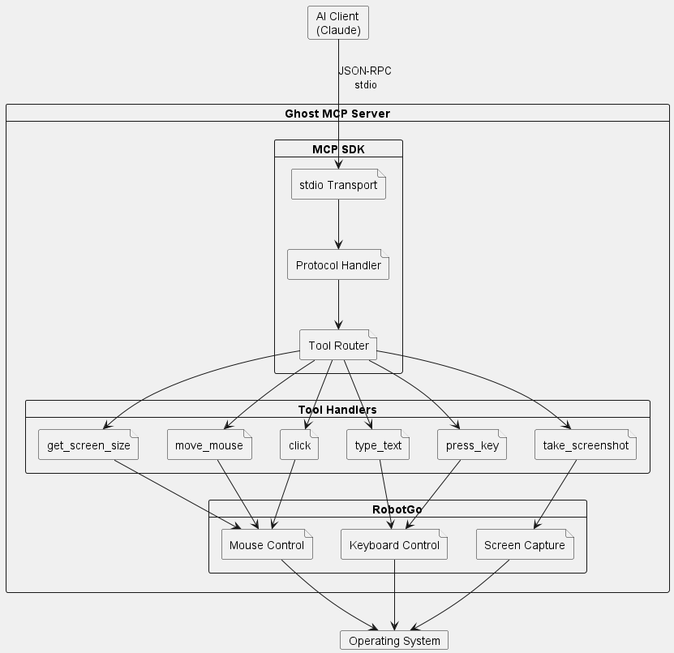
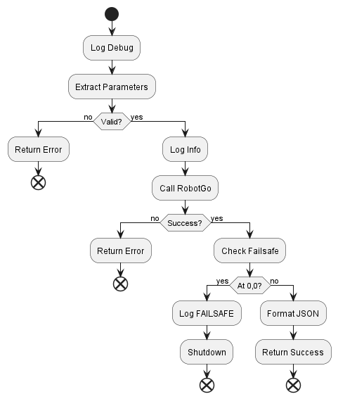
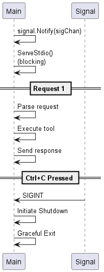

# Ghost MCP Architecture

This document describes the internal architecture and design decisions of the Ghost MCP server.

## System Overview



The Ghost MCP server sits between an AI client (like Claude) and the operating system, providing a safe, sandboxed interface for UI automation through the MCP protocol over stdio.

## Core Components

### 1. Main Entry Point (`main()`)


The entry point orchestrates server initialization:

1. **Logging Setup**: Initializes stderr-based logging
2. **Signal Handling**: Registers handlers for SIGINT/SIGTERM
3. **Server Creation**: Calls `createServer()` to build the MCP server
4. **Blocking Serve**: Calls `server.ServeStdio()` which blocks until shutdown

### 2. MCP Server (`createServer()`)

Creates and configures the MCP server instance:

```go
mcpServer := server.NewMCPServer(
    ServerName,     // "ghost-mcp"
    ServerVersion,  // "1.0.0"
    server.WithResourceCapabilities(true, true),
)
```

### 3. Tool Registration (`registerTools()`)

Registers each tool with its schema and handler:

```
registerTools()
  │
  ├─► AddTool("get_screen_size", schema, handleGetScreenSize)
  ├─► AddTool("move_mouse", schema, handleMoveMouse)
  ├─► AddTool("click", schema, handleClick)
  ├─► AddTool("type_text", schema, handleTypeText)
  ├─► AddTool("press_key", schema, handlePressKey)
  └─► AddTool("take_screenshot", schema, handleTakeScreenshot)
```

Each tool definition includes:
- **Name**: Unique identifier
- **Description**: Human-readable explanation
- **Parameters**: Typed arguments with descriptions
- **Handler**: Function that executes the tool

### 4. Tool Handlers



Each tool follows a consistent pattern:

#### Handler Signatures

All handlers follow the MCP SDK convention:

```go
func handleToolName(
    ctx context.Context, 
    request mcp.CallToolRequest,
) (*mcp.CallToolResult, error)
```

### 5. Parameter Extraction Helpers

Generic functions for type-safe parameter extraction:

```go
// getStringParam extracts a string parameter
func getStringParam(request mcp.CallToolRequest, name string) (string, error)

// getIntParam extracts an integer parameter (handles float64 from JSON)
func getIntParam(request mcp.CallToolRequest, name string) (int, error)
```

These handle JSON's tendency to decode numbers as `float64`.

### 6. Logging System

**Critical Design Decision**: All logs go to stderr.

```
┌────────────────────────────────────────────────────┐
│                    stdout                          │
│  (MCP JSON-RPC Protocol - MUST stay clean)         │
│  {"jsonrpc":"2.0","result":{...}}                  │
└────────────────────────────────────────────────────┘

┌────────────────────────────────────────────────────┐
│                    stderr                          │
│  (Application Logs - Safe for debugging)           │
│  [INFO] Starting ghost-mcp v1.0.0...               │
│  [DEBUG] Handling move_mouse request               │
│  [ERROR] Invalid parameter: x                      │
└────────────────────────────────────────────────────┘
```

Logging functions:
- `logInfo()`: Informational messages
- `logError()`: Error conditions
- `logDebug()`: Debug output (only when `GHOST_MCP_DEBUG=1`)

### 7. Failsafe Mechanism

Emergency shutdown to prevent runaway automation:

```
checkFailsafe()
  │
  ├─► robotgo.GetMousePos() - Get current position
  │
  ├─► if x == 0 && y == 0
  │     │
  │     ├─► logError("FAILSAFE TRIGGERED...")
  │     │
  │     └─► initiateShutdown()
  │           │
  │           ├─► Set state.isShuttingDown = true
  │           │
  │           └─► Close state.shutdownChan
  │
  └─► return nil (if not triggered)
```

**When triggered**:
1. Logs error to stderr
2. Sets shutdown flag
3. Closes shutdown channel
4. Returns error to tool caller

### 8. Global State

```go
type serverState struct {
    shutdownChan chan struct{}  // Signal for shutdown
    isShuttingDown bool          // Shutdown flag
}

var state = &serverState{
    shutdownChan: make(chan struct{}),
}
```

## Data Flow

### Request Flow (Client → Server → Tool)

```
1. Client sends JSON-RPC request via stdin
   {"jsonrpc":"2.0","method":"tools/call",
    "params":{"name":"move_mouse","arguments":{"x":100,"y":200}}}

2. MCP SDK parses and validates JSON

3. SDK routes to registered handler
   handleMoveMouse(ctx, request)

4. Handler extracts parameters
   x := getIntParam(request, "x")  // 100
   y := getIntParam(request, "y")  // 200

5. Handler calls RobotGo
   robotgo.MoveSmooth(100, 200)

6. Handler checks failsafe
   checkFailsafe()

7. Handler returns result
   return mcp.NewToolResultText(`{"success":true,"x":100,"y":200}`)

8. MCP SDK formats response
   {"jsonrpc":"2.0","result":{"content":[{"text":"..."}]}}

9. Response written to stdout
```

### Response Format

All tool responses are JSON strings wrapped in MCP result:

```json
{
  "jsonrpc": "2.0",
  "id": 1,
  "result": {
    "content": [
      {
        "type": "text",
        "text": "{\"success\": true, \"x\": 100, \"y\": 200}"
      }
    ]
  }
}
```

## Error Handling

### Parameter Errors

```go
// Missing parameter
x, err := getIntParam(request, "x")
if err != nil {
    return mcp.NewToolResultError(err.Error()), nil
}

// Invalid type
button, err := getStringParam(request, "button")
if err != nil {
    return mcp.NewToolResultError(fmt.Sprintf("invalid button: %v", err)), nil
}
```

### RobotGo Errors

```go
bitmap := robotgo.CaptureScreen(x, y, width, height)
if bitmap == nil {
    return mcp.NewToolResultError("failed to capture screen"), nil
}
```

### Failsafe Errors

```go
if err := checkFailsafe(); err != nil {
    return mcp.NewToolResultError(err.Error()), nil
}
```

## Concurrency Model



The server handles requests sequentially via ServeStdio(), which is appropriate for stdio transport.
## Tool Specifications

### get_screen_size

| Aspect | Details |
|--------|---------|
| **Purpose** | Get primary monitor dimensions |
| **Parameters** | None |
| **Returns** | `{"width": int, "height": int}` |
| **RobotGo Call** | `robotgo.GetScreenSize()` |

### move_mouse

| Aspect | Details |
|--------|---------|
| **Purpose** | Move cursor to coordinates |
| **Parameters** | `x` (int), `y` (int) |
| **Returns** | `{"success": bool, "x": int, "y": int}` |
| **RobotGo Call** | `robotgo.MoveSmooth(x, y)` |
| **Failsafe** | ✓ Checked after movement |

### click

| Aspect | Details |
|--------|---------|
| **Purpose** | Click at current position |
| **Parameters** | `button` ("left", "right", "middle") |
| **Returns** | `{"success": bool, "button": string, "x": int, "y": int}` |
| **RobotGo Call** | `robotgo.Click(button, true)` |
| **Failsafe** | ✓ Checked after click |

### type_text

| Aspect | Details |
|--------|---------|
| **Purpose** | Type text via keyboard |
| **Parameters** | `text` (string) |
| **Returns** | `{"success": bool, "characters_typed": int}` |
| **RobotGo Call** | `robotgo.TypeStr(text)` |

### press_key

| Aspect | Details |
|--------|---------|
| **Purpose** | Press single key |
| **Parameters** | `key` (string) |
| **Returns** | `{"success": bool, "key": string}` |
| **RobotGo Call** | `robotgo.KeyTap(key)` |

### take_screenshot

| Aspect | Details |
|--------|---------|
| **Purpose** | Capture screen as PNG |
| **Parameters** | `x`, `y`, `width`, `height` (all optional) |
| **Returns** | `{"success": bool, "filepath": string, "base64": string, "width": int, "height": int}` |
| **RobotGo Calls** | `robotgo.CaptureScreen()`, `robotgo.SavePng()` |
| **Cleanup** | Temp file deleted after encoding |

## Dependencies

### Direct Dependencies

| Package | Purpose |
|---------|---------|
| `github.com/mark3labs/mcp-go` | MCP protocol implementation |
| `github.com/go-vgo/robotgo` | OS-level automation |

### Standard Library

| Package | Purpose |
|---------|---------|
| `context` | Request context propagation |
| `encoding/base64` | Screenshot encoding |
| `fmt` | Formatting |
| `os` | File operations, env vars, stderr |
| `os/signal` | Signal handling |
| `path/filepath` | Path manipulation |
| `runtime` | Platform detection |
| `syscall` | Signal constants |
| `time` | Timestamps |

## Security Considerations

### 1. Failsafe Position

The (0,0) failsafe prevents infinite loops but:
- Users should avoid placing important UI elements at (0,0)
- AI should be instructed not to move to (0,0) intentionally

### 2. Stdio-Only Transport

- No network exposure
- Only accessible to processes that can spawn the binary
- No authentication (relies on client config security)

### 3. Permission Requirements

- Requires accessibility permissions on macOS
- May require admin on Windows for some operations
- Linux requires X11 access

### 4. Screenshot Data

- Screenshots encoded as base64 in responses
- Temporary files cleaned up immediately
- No persistent storage of captured data

## Testing Strategy

### Unit Tests (`main_test.go`)

Tests focus on:
1. **Parameter extraction** - Type conversion, missing params
2. **Handler logic** - Response format, error handling
3. **Failsafe** - Shutdown triggering
4. **Logging** - No panics in logging functions

### Integration Testing

Manual testing required for:
- Actual mouse movement
- Keyboard input
- Screen capture
- Cross-platform behavior

### Test Limitations

- RobotGo requires display/graphics environment
- CI/CD needs virtual display (Xvfb, etc.)
- Some tests skipped without display

## Extension Points

### Adding New Tools

1. Implement handler function:
   ```go
   func handleNewTool(ctx context.Context, request mcp.CallToolRequest) (*mcp.CallToolResult, error)
   ```

2. Register in `registerTools()`:
   ```go
   mcpServer.AddTool(mcp.NewTool(
       "new_tool",
       mcp.WithDescription("..."),
       mcp.WithString("param", mcp.Required()),
   ), handleNewTool)
   ```

### Adding New Transports

The MCP SDK supports other transports:
- HTTP/SSE for remote servers
- WebSocket for bidirectional communication

Modify `main()` to use alternative transport instead of `ServeStdio()`.

## Performance Considerations

### Memory

- Screenshots held in memory during base64 encoding
- Large screens may require significant memory
- Temp file cleanup is immediate

### Latency

- Mouse movement uses smooth animation (not instant)
- Keyboard typing has inherent OS latency
- Screenshot capture is blocking

### Throughput

- Sequential request handling (stdio limitation)
- No request queuing or batching
- Suitable for interactive AI use, not high-volume automation

## Debugging

### Enable Debug Logging

```json
{
  "env": {
    "GHOST_MCP_DEBUG": "1"
  }
}
```

### Log Output

Debug logs show:
- Incoming requests
- Parameter values
- RobotGo calls
- Response data

### Common Debug Scenarios

1. **Tool not found**: Check tool name in registration
2. **Parameter errors**: Verify parameter types in schema
3. **RobotGo failures**: Check platform permissions
4. **Protocol errors**: Ensure no stdout pollution


