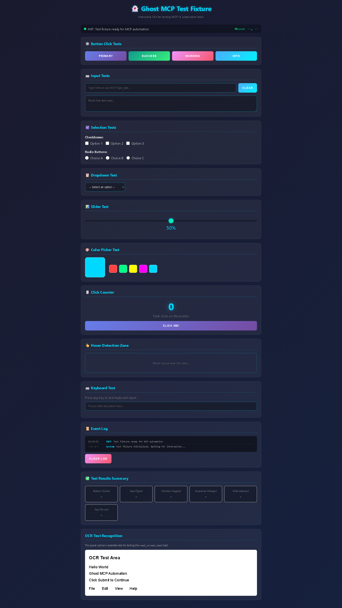
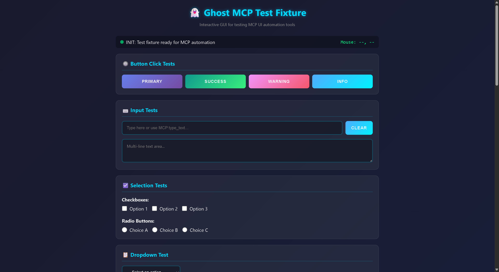
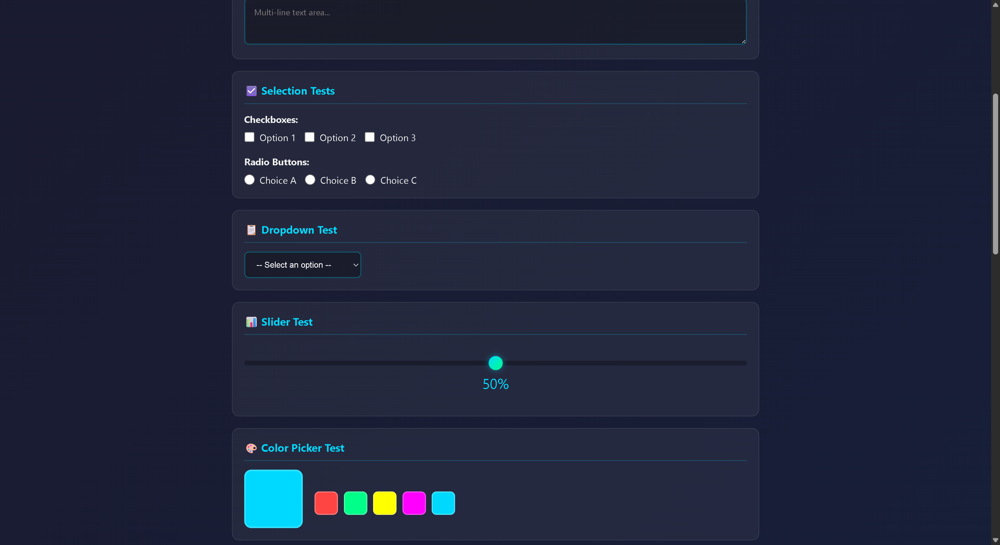
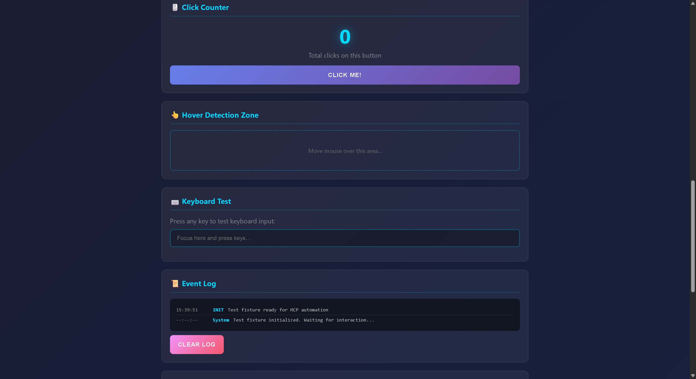
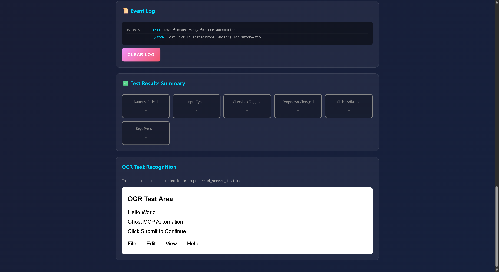
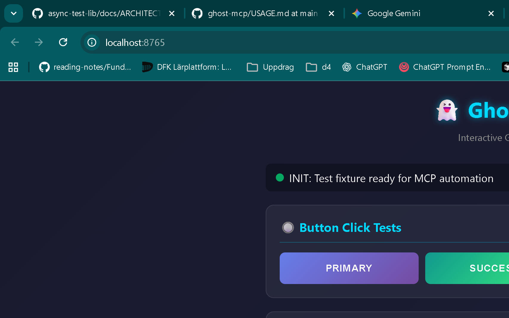

# Ghost MCP Usage Guide

This guide demonstrates how to use Ghost MCP to automate UI interactions through the Model Context Protocol (MCP). It includes step-by-step examples with the interactive test fixture.

## Table of Contents

- [Quick Start](#quick-start)
- [Starting the Test Fixture](#starting-the-test-fixture)
- [Using Ghost MCP Tools](#using-ghost-mcp-tools)
- [Interactive Test Fixture](#interactive-test-fixture)
- [OCR Text Payloads](#ocr-text-payloads)
- [Example Workflows](#example-workflows)
- [API Reference](#api-reference)

## Quick Start

### Prerequisites

- Go 1.24 or later
- GCC/MinGW (required for robotgo on Windows)
- A display environment (Linux requires X11, Windows/macOS have it by default)
- [Tesseract OCR](https://github.com/tesseract-ocr/tesseract) + `TESSDATA_PREFIX` set (required for OCR tools)

### Installation

1. Clone the repository:
```bash
git clone https://github.com/PIsberg/ghost-mcp.git
cd ghost-mcp
```

2. Download dependencies:
```bash
go mod download
```

3. Build the binary:
```bash
# Windows
go build -o ghost-mcp.exe ./cmd/ghost-mcp/

# macOS/Linux
go build -o ghost-mcp ./cmd/ghost-mcp/
```

## Starting the Test Fixture

The test fixture is an interactive web application that simulates a GUI for testing UI automation.

```bash
# Windows
test_runner.bat fixture

# macOS/Linux
./test_runner.sh fixture
```

The fixture will be available at: **http://localhost:8765**

## Using Ghost MCP Tools

Ghost MCP provides eleven tools for UI automation. OCR is always built in — `read_screen_text` and `find_and_click` require Tesseract to be installed and `TESSDATA_PREFIX` to be set.

---

### 1. **Get Screen Size**

Returns the dimensions of the primary display.

```json
{ "tool": "get_screen_size", "arguments": {} }
```

```json
{ "width": 1920, "height": 1080 }
```

---

### 2. **Move Mouse**

Moves the mouse cursor to specified coordinates.

```json
{ "tool": "move_mouse", "arguments": { "x": 400, "y": 300 } }
```

```json
{ "success": true, "x": 400, "y": 300 }
```

---

### 3. **Click**

Performs a mouse click at the current cursor position.

```json
{ "tool": "click", "arguments": { "button": "left" } }
```

`button`: `"left"` (default), `"right"`, or `"middle"`

---

### 4. **Click At** *(preferred)*

Moves the mouse to the given coordinates and clicks — one call instead of two.

```json
{ "tool": "click_at", "arguments": { "x": 400, "y": 300 } }
```

```json
{ "success": true, "button": "left", "x": 400, "y": 300 }
```

`button` is optional and defaults to `"left"`.

---

### 5. **Double Click**

Moves the mouse and performs a left double-click. Use for opening files or selecting words.

```json
{ "tool": "double_click", "arguments": { "x": 400, "y": 300 } }
```

```json
{ "success": true, "x": 400, "y": 300 }
```

---

### 6. **Scroll**

Moves the mouse to the given position and scrolls the wheel.

```json
{ "tool": "scroll", "arguments": { "x": 400, "y": 300, "direction": "down", "amount": 5 } }
```

```json
{ "success": true, "x": 400, "y": 300, "direction": "down", "amount": 5 }
```

`direction`: `"up"`, `"down"`, `"left"`, `"right"`. `amount` defaults to `3`.

---

### 7. **Type Text**

Types text via the keyboard into the focused element.

```json
{ "tool": "type_text", "arguments": { "text": "Hello, Ghost MCP!" } }
```

```json
{ "success": true, "characters_typed": 17 }
```

---

### 8. **Press Key**

Presses a single key on the keyboard.

```json
{ "tool": "press_key", "arguments": { "key": "enter" } }
```

Supported keys include: `enter`, `tab`, `esc`, `space`, `backspace`, `delete`, `home`, `end`, `pageup`, `pagedown`, `up`, `down`, `left`, `right`, `ctrl`, `alt`, `shift`, `f1`–`f12`, and single characters.

---

### 9. **Take Screenshot**

Captures a screen region and returns a PNG image. The response has two parts: a JSON metadata text block and an `image/png` content block with the image data.

```json
{
  "tool": "take_screenshot",
  "arguments": { "x": 0, "y": 0, "width": 1920, "height": 1080 }
}
```

```json
{ "success": true, "filepath": "/tmp/ghost-mcp-screenshot-....png", "width": 1920, "height": 1080 }
```

All parameters are optional — omitting them captures the full screen. Set `GHOST_MCP_KEEP_SCREENSHOTS=1` to keep the file on disk after the response is sent.

---

### 10. **Read Screen Text** (OCR)

Captures a screen region, runs OCR, and returns the text with word-level bounding boxes. The coordinates in the response can be passed directly to `move_mouse` to click specific words.

```json
{
  "tool": "read_screen_text",
  "arguments": { "x": 0, "y": 0, "width": 800, "height": 400 }
}
```

```json
{
  "success": true,
  "text": "File  Edit  View  Help\nGhost MCP Automation\nClick Submit to Continue",
  "words": [
    { "text": "File",   "x": 10,  "y": 20,  "width": 28, "height": 14, "confidence": 98.5 },
    { "text": "Edit",   "x": 58,  "y": 20,  "width": 26, "height": 14, "confidence": 97.2 },
    { "text": "Submit", "x": 110, "y": 68,  "width": 52, "height": 16, "confidence": 96.8 }
  ],
  "region": { "x": 0, "y": 0, "width": 800, "height": 400 }
}
```

All parameters are optional — omitting them reads the full screen.

> Word coordinates are **relative to the region origin** — add the region's `x`/`y` to get absolute screen coordinates.

---

### 11. **Find and Click** (OCR) *(preferred for text targets)*

Scans the full screen with OCR, finds the nth word matching `text` (case-insensitive substring), and clicks its center. Combines `read_screen_text` + `click_at` in one call.

```json
{ "tool": "find_and_click", "arguments": { "text": "Submit" } }
```

```json
{ "success": true, "found": "Submit", "x": 188, "y": 2768, "button": "left", "occurrence": 1 }
```

`button` defaults to `"left"`. `nth` defaults to `1` — use `2`, `3`, etc. to click the second or third match when the text appears multiple times.

---

## Interactive Test Fixture

The fixture at `http://localhost:8765` contains every control type Ghost MCP can interact with.

### Full Page Overview



---

### Top of Page — Buttons and Input Fields

The top section shows the status bar, four coloured buttons, and text input fields.



**Button click workflow (using find_and_click):**
```json
[
  { "tool": "find_and_click",   "arguments": { "text": "PRIMARY" } },
  { "tool": "take_screenshot",  "arguments": {} }
]
```

**Button click workflow (using click_at with known coordinates):**
```json
[
  { "tool": "click_at",        "arguments": { "x": 183, "y": 98 } },
  { "tool": "take_screenshot", "arguments": {} }
]
```

**Text input workflow:**
```json
[
  { "tool": "click_at",  "arguments": { "x": 400, "y": 150 } },
  { "tool": "type_text", "arguments": { "text": "Automated input" } }
]
```

---

### Selection Controls — Checkboxes, Radio Buttons, Dropdown, Slider



**Checkbox toggle:**
```json
[
  { "tool": "click_at", "arguments": { "x": 205, "y": 240 } }
]
```

**Dropdown selection:**
```json
[
  { "tool": "click_at", "arguments": { "x": 245, "y": 340 } }
]
```

---

### Lower Controls — Slider, Color Picker, Click Counter, Hover Zone


**Click counter:**
```json
[
  { "tool": "click_at", "arguments": { "x": 397, "y": 308 } },
  { "tool": "click_at", "arguments": { "x": 397, "y": 308 } },
  { "tool": "click_at", "arguments": { "x": 397, "y": 308 } }
]
```

---

### Keyboard Test, Event Log, and Test Results



**Keyboard test workflow:**
```json
[
  { "tool": "click_at",  "arguments": { "x": 300, "y": 190 } },
  { "tool": "press_key", "arguments": { "key": "enter" } },
  { "tool": "press_key", "arguments": { "key": "tab" } }
]
```

---

### OCR Text Recognition Panel

The OCR panel contains high-contrast text for reliable OCR testing.



---

### Test Results Summary

After running through all interactions, the results summary shows which tests passed.



---

## OCR Text Payloads

This section shows what `read_screen_text` returns when pointed at different parts of the fixture.

### Full fixture page (top viewport)

Calling `read_screen_text` with no arguments on the fixture page returns something like:

```json
{
  "success": true,
  "text": "Ghost MCP Test Fixture\nInteractive GUI for testing MCP UI automation tools\nINIT: Test fixture ready for MCP automation\nMouse: ...\nButton Click Tests\nPRIMARY  SUCCESS  WARNING  INFO\nInput Tests\nType here or use MCP type_text...\nCLEAR\nMulti-line text area...\nSelection Tests\nCheckboxes:\nOption 1  Option 2  Option 3\nRadio Buttons:\nChoice A  Choice B  Choice C\nDropdown Test\n-- Select an option --",
  "words": [
    { "text": "Ghost",      "x": 350, "y": 10,  "width": 45, "height": 18, "confidence": 98.2 },
    { "text": "MCP",        "x": 400, "y": 10,  "width": 32, "height": 18, "confidence": 97.9 },
    { "text": "Test",       "x": 436, "y": 10,  "width": 30, "height": 18, "confidence": 98.5 },
    { "text": "Fixture",    "x": 470, "y": 10,  "width": 48, "height": 18, "confidence": 97.1 },
    { "text": "PRIMARY",    "x": 149, "y": 88,  "width": 65, "height": 14, "confidence": 96.4 },
    { "text": "SUCCESS",    "x": 232, "y": 88,  "width": 65, "height": 14, "confidence": 97.0 },
    { "text": "WARNING",    "x": 315, "y": 88,  "width": 65, "height": 14, "confidence": 95.8 },
    { "text": "INFO",       "x": 398, "y": 88,  "width": 35, "height": 14, "confidence": 98.1 }
  ],
  "region": { "x": 0, "y": 0, "width": 1707, "height": 932 }
}
```

### OCR test panel (white background area)

Targeting just the white OCR test panel at the bottom of the fixture gives a clean, high-confidence result:

```json
{
  "success": true,
  "text": "OCR Test Area\nHello World\nGhost MCP Automation\nClick Submit to Continue\nFile  Edit  View  Help",
  "words": [
    { "text": "OCR",        "x": 10,  "y": 8,   "width": 28, "height": 20, "confidence": 99.1 },
    { "text": "Test",       "x": 42,  "y": 8,   "width": 28, "height": 20, "confidence": 99.3 },
    { "text": "Area",       "x": 74,  "y": 8,   "width": 30, "height": 20, "confidence": 99.2 },
    { "text": "Hello",      "x": 10,  "y": 40,  "width": 38, "height": 16, "confidence": 99.5 },
    { "text": "World",      "x": 52,  "y": 40,  "width": 38, "height": 16, "confidence": 99.4 },
    { "text": "Ghost",      "x": 10,  "y": 64,  "width": 38, "height": 16, "confidence": 99.2 },
    { "text": "MCP",        "x": 52,  "y": 64,  "width": 28, "height": 16, "confidence": 99.0 },
    { "text": "Automation", "x": 84,  "y": 64,  "width": 72, "height": 16, "confidence": 98.9 },
    { "text": "Click",      "x": 10,  "y": 88,  "width": 34, "height": 16, "confidence": 99.3 },
    { "text": "Submit",     "x": 48,  "y": 88,  "width": 44, "height": 16, "confidence": 99.1 },
    { "text": "to",         "x": 96,  "y": 88,  "width": 14, "height": 16, "confidence": 98.8 },
    { "text": "Continue",   "x": 114, "y": 88,  "width": 58, "height": 16, "confidence": 99.0 },
    { "text": "File",       "x": 10,  "y": 116, "width": 22, "height": 14, "confidence": 99.2 },
    { "text": "Edit",       "x": 62,  "y": 116, "width": 22, "height": 14, "confidence": 99.1 },
    { "text": "View",       "x": 122, "y": 116, "width": 28, "height": 14, "confidence": 99.0 },
    { "text": "Help",       "x": 182, "y": 116, "width": 24, "height": 14, "confidence": 99.3 }
  ],
  "region": { "x": 140, "y": 2680, "width": 600, "height": 200 }
}
```

### OCR-driven click examples

**Simplest — use `find_and_click` directly:**
```json
{ "tool": "find_and_click", "arguments": { "text": "Submit" } }
```

**Manual — use `read_screen_text` then `click_at` with offset arithmetic:**
```json
[
  {
    "tool": "read_screen_text",
    "arguments": { "x": 140, "y": 2680, "width": 600, "height": 200 }
  },
  {
    "comment": "AI finds 'Submit' at word.x=48, word.y=88. Absolute = 48+140=188, 88+2680=2768. Center = 188+22=210, 2768+8=2776."
  },
  { "tool": "click_at", "arguments": { "x": 210, "y": 2776 } }
]
```

> `read_screen_text` returns word coordinates **relative to the region origin** — add the region's `x`/`y` to get absolute screen coordinates. `find_and_click` handles this automatically.

---

## Example Workflows

### OCR-first workflow (recommended)

Use `find_and_click` to locate and click elements by their visible text label — no coordinate guessing:

```json
[
  { "tool": "get_screen_size",  "arguments": {} },
  { "tool": "find_and_click",   "arguments": { "text": "PRIMARY" } },
  { "tool": "take_screenshot",  "arguments": {} },
  { "tool": "find_and_click",   "arguments": { "text": "Type here" } },
  { "tool": "type_text",        "arguments": { "text": "Automated test data" } },
  { "tool": "find_and_click",   "arguments": { "text": "Option 1" } },
  { "tool": "take_screenshot",  "arguments": {} }
]
```

### Scroll and interact

```json
[
  { "tool": "find_and_click", "arguments": { "text": "Dropdown" } },
  { "tool": "scroll",         "arguments": { "x": 400, "y": 400, "direction": "down", "amount": 3 } },
  { "tool": "take_screenshot","arguments": {} }
]
```

### Form navigation with keyboard

```json
[
  { "tool": "click_at",  "arguments": { "x": 400, "y": 150 } },
  { "tool": "type_text", "arguments": { "text": "Username" } },
  { "tool": "press_key", "arguments": { "key": "tab" } },
  { "tool": "type_text", "arguments": { "text": "Password123" } },
  { "tool": "press_key", "arguments": { "key": "enter" } }
]
```

### Open a file with double-click

```json
[
  { "tool": "find_and_click",  "arguments": { "text": "document.txt", "button": "left" } },
  { "tool": "double_click",    "arguments": { "x": 400, "y": 300 } }
]
```

---

## API Reference

### Tool: get_screen_size

**Arguments:** none

**Returns:** `{ "width": 1920, "height": 1080 }`

---

### Tool: move_mouse

**Arguments:**
- `x` (number, required): X-coordinate in pixels
- `y` (number, required): Y-coordinate in pixels

**Returns:** `{ "success": true, "x": 400, "y": 300 }`

---

### Tool: click

**Arguments:**
- `button` (string, required): `"left"`, `"right"`, or `"middle"`

**Returns:** `{ "success": true, "button": "left", "x": 400, "y": 300 }`

---

### Tool: click_at

**Arguments:**
- `x` (number, required): X-coordinate in pixels
- `y` (number, required): Y-coordinate in pixels
- `button` (string, optional): `"left"` (default), `"right"`, or `"middle"`

**Returns:** `{ "success": true, "button": "left", "x": 400, "y": 300 }`

---

### Tool: double_click

**Arguments:**
- `x` (number, required): X-coordinate in pixels
- `y` (number, required): Y-coordinate in pixels

**Returns:** `{ "success": true, "x": 400, "y": 300 }`

---

### Tool: scroll

**Arguments:**
- `x` (number, required): X-coordinate to scroll at
- `y` (number, required): Y-coordinate to scroll at
- `direction` (string, required): `"up"`, `"down"`, `"left"`, or `"right"`
- `amount` (number, optional): Scroll steps, default `3`

**Returns:** `{ "success": true, "x": 400, "y": 300, "direction": "down", "amount": 3 }`

---

### Tool: type_text

**Arguments:**
- `text` (string, required): Text to type (max 10,000 characters)

**Returns:** `{ "success": true, "characters_typed": 16 }`

---

### Tool: press_key

**Arguments:**
- `key` (string, required): Key name (e.g. `"enter"`, `"tab"`, `"esc"`, `"ctrl"`)

**Returns:** `{ "success": true, "key": "enter" }`

---

### Tool: take_screenshot

**Arguments** (all optional):
- `x` (number): X coordinate of region (default: 0)
- `y` (number): Y coordinate of region (default: 0)
- `width` (number): Width of region (default: full screen)
- `height` (number): Height of region (default: full screen)

**Returns:** Two content blocks — JSON metadata + PNG image:
```json
{ "success": true, "filepath": "/tmp/ghost-mcp-screenshot-1234.png", "width": 1920, "height": 1080 }
```
*(image data is in a separate `image/png` content block, not in the JSON)*

Set `GHOST_MCP_KEEP_SCREENSHOTS=1` to keep the file on disk.

---

### Tool: read_screen_text

Reads text from a screen region using OCR. Requires Tesseract and `TESSDATA_PREFIX`.

**Arguments** (all optional):
- `x` (number): X coordinate of region (default: 0)
- `y` (number): Y coordinate of region (default: 0)
- `width` (number): Width of region (default: full screen)
- `height` (number): Height of region (default: full screen)

**Returns:**
```json
{
  "success": true,
  "text": "Full extracted text with newlines",
  "words": [
    {
      "text": "Submit",
      "x": 450, "y": 320,
      "width": 60, "height": 20,
      "confidence": 97.1
    }
  ],
  "region": { "x": 0, "y": 0, "width": 1920, "height": 1080 }
}
```

Word coordinates are **relative to the region origin** — add the region's `x`/`y` to get absolute screen positions.

---

### Tool: find_and_click

Scans the full screen with OCR, finds the nth word matching `text`, and clicks its center. Requires Tesseract and `TESSDATA_PREFIX`.

**Arguments:**
- `text` (string, required): Text to search for (case-insensitive substring match)
- `button` (string, optional): `"left"` (default), `"right"`, or `"middle"`
- `nth` (number, optional): Which occurrence to click (default: `1`)

**Returns:**
```json
{ "success": true, "found": "Submit", "x": 188, "y": 2768, "button": "left", "occurrence": 1 }
```

Returns an error result if the text is not found on screen.

---

## Best Practices

### 1. Prefer find_and_click for text targets
Use `find_and_click` to locate and click elements by their visible text label rather than hardcoding coordinates:
```json
{ "tool": "find_and_click", "arguments": { "text": "Save" } }
```

### 2. Prefer click_at over move_mouse + click
`click_at` is one tool call instead of two, and is the preferred pattern for coordinate-based clicks:
```json
{ "tool": "click_at", "arguments": { "x": 400, "y": 300 } }
```

### 3. Verify with screenshots
Take a screenshot after key actions to confirm the UI changed as expected.

### 4. Avoid the failsafe position
Don't move the mouse to (0, 0) — this triggers an emergency shutdown.

### 5. Use regions for faster OCR
Narrow `read_screen_text` to the area of interest for quicker, more accurate results:
```json
{ "tool": "read_screen_text", "arguments": { "x": 0, "y": 0, "width": 800, "height": 100 } }
```

### 6. Convert word coordinates from read_screen_text
`read_screen_text` returns coordinates relative to the region. Add the region offset for absolute screen coords:
```
absolute_x = word.x + region.x
absolute_y = word.y + region.y
```
(`find_and_click` handles this automatically.)

---

## Troubleshooting

### Mouse Not Responding
- **macOS**: Grant Terminal accessibility permissions (System Preferences → Security & Privacy → Accessibility)
- **Linux**: Check X11 permissions with `xhost +`
- **Windows**: Try running as Administrator

### Tesseract / OCR Not Working

On Windows, Tesseract must be installed via vcpkg (not Chocolatey) and `TESSDATA_PREFIX` must be set:
```powershell
# Install via vcpkg (MinGW-compatible)
.\vcpkg install tesseract:x64-mingw-dynamic leptonica:x64-mingw-dynamic
# Download language data
$tessdata = "$env:USERPROFILE\vcpkg\installed\x64-mingw-dynamic\share\tessdata"
Invoke-WebRequest "https://github.com/tesseract-ocr/tessdata_fast/raw/main/eng.traineddata" -OutFile "$tessdata\eng.traineddata"
# Set env var
[System.Environment]::SetEnvironmentVariable("TESSDATA_PREFIX", "$env:USERPROFILE\vcpkg\installed\x64-mingw-dynamic\share", "User")
```

On macOS/Linux:
```bash
brew install tesseract          # macOS
sudo apt install tesseract-ocr  # Ubuntu/Debian
```

Check `TESSDATA_PREFIX` points to the **parent** of `tessdata/`:
```bash
ls $TESSDATA_PREFIX/tessdata/eng.traineddata
```

### Fixture Port Already in Use
```bash
# Use a different port
export FIXTURE_PORT=9000
go run ./cmd/ghost-mcp/test_fixture/
```

### GCC Not Found (build error)
```bash
# Windows (Chocolatey)
choco install mingw

# macOS
xcode-select --install

# Ubuntu/Debian
sudo apt install gcc libx11-dev xorg-dev libxtst-dev libpng-dev
```

### No Display Available (Linux)
```bash
sudo apt install xvfb
export DISPLAY=:99
Xvfb :99 &
```

---

## See Also

- [TESTING.md](TESTING.md) - Comprehensive testing guide
- [ARCHITECTURE.md](ARCHITECTURE.md) - System architecture
